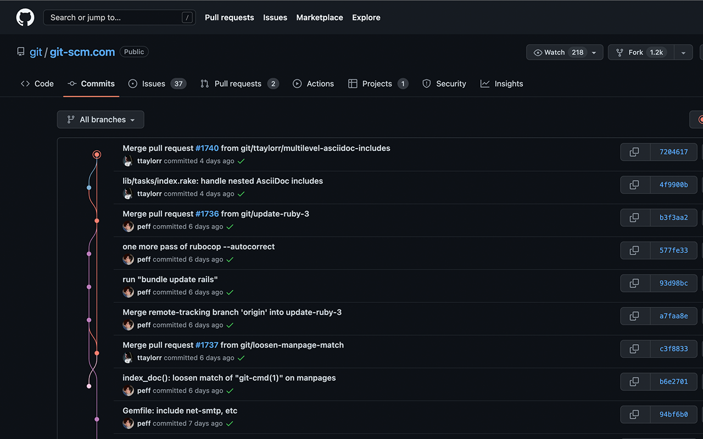

<!-- TOC BEGIN -->
## Table Of Contents
- [← Back : gitHub](gitHub.md)
- [Visualize Commit Tree And Branches In Github](#visualize-commit-tree-and-branches-in-github)
<!-- TOC END -->

# Visualize Commit Tree And Branches In Github

Do you miss a nice visualization of your git tree in Github?

`Le Git Graph - Commits Graph for GitHub` is the extension you are looking for

- Get it from [Le Git Graph - Extensions](https://chromewebstore.google.com/detail/le-git-graph-commits-grap/joggkdfebigddmaagckekihhfncdobff)
- Give the required authorizations
- You will see a new tab `commits` in the top bar and you will see your git tree

*Let Git Graph - from [Le Git Graph - Extensions](https://chromewebstore.google.com/detail/le-git-graph-commits-grap/joggkdfebigddmaagckekihhfncdobff)*
